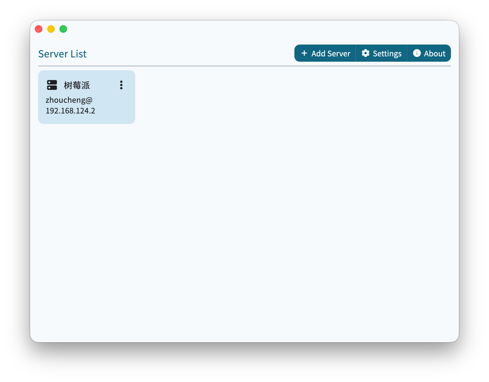
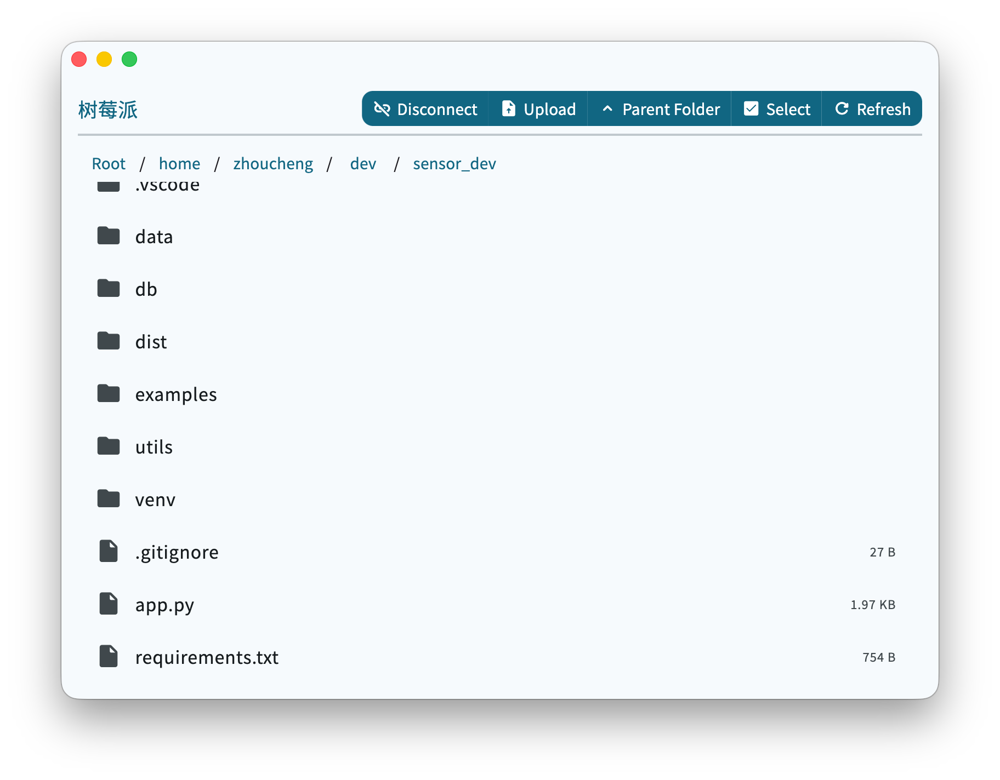

# Server Express

## Intro

This is a SFTP client based on Flutter  
Support English and Chinese (Simplified & Traditional)

The core framework is available [here](https://github.com/Zhoucheng133/Server-Express-Core).

## Screenshot

## Build on Your Device

- Install Flutter. For installation steps, see [Flutter - Quick start](https://docs.flutter.cn/get-started/quick).  
- It is recommended to open the project using Visual Studio Code.
  - In the bottom-right corner of Visual Studio Code, find the `Device` button (it may also display available devices), and select the target device or emulator.
  - In the **Run and Debug** panel, choose `Debug`, `Profile`, or `Release`.  
    For detailed differences between these modes, see the [Flutter official documentation](https://docs.flutter.dev/testing/build-modes).